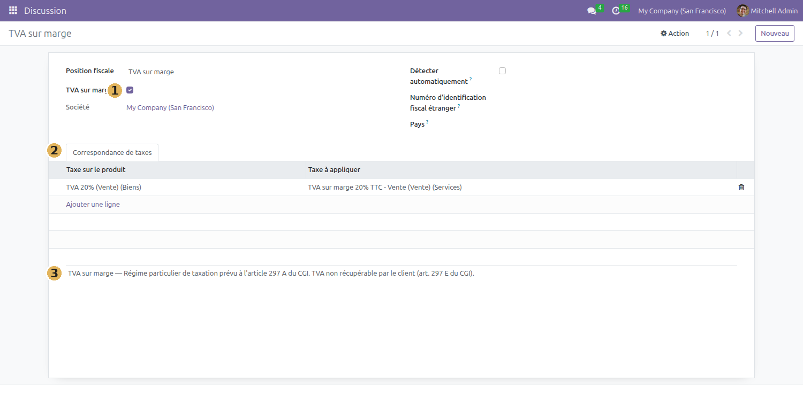
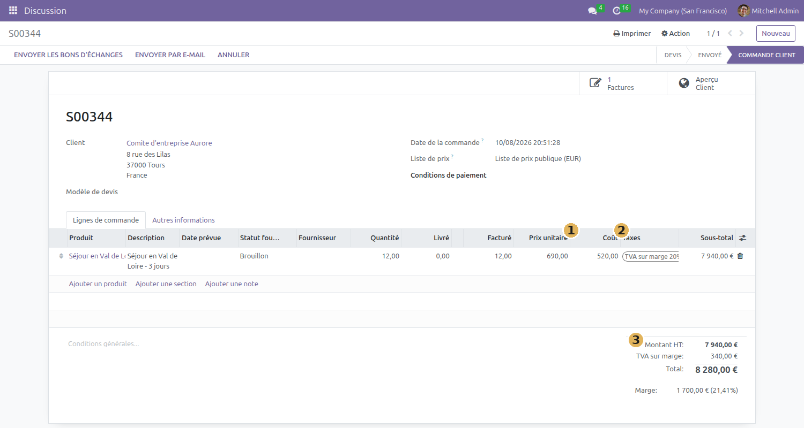
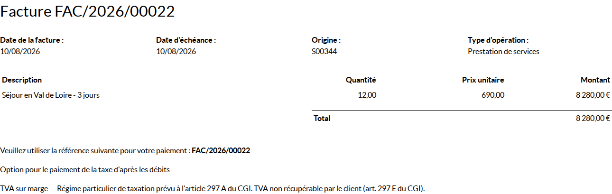

# Utiliser la TVA sur marge

Une agence de voyages qui revend une prestation achetée à un tiers ne collecte
pas la TVA sur le prix de vente, mais sur ce qu'elle garde : la différence entre
ce qu'elle vend et ce qu'elle a payé. C'est le régime particulier de l'article
297 A du CGI. Ce module l'applique dans Odoo, de la saisie du devis jusqu'à la
facture imprimée.

> **Avant de commencer** — le module `l10n_fr_vat_on_margin` est installé et
> votre société a chargé le plan comptable français. Les taxes en marge sont
> alors créées automatiquement pour chacun des trois taux.

## Ce que le régime change

Trois obligations, que le module prend en charge :

| Le texte | Ce qu'il impose | Ce que fait le module |
|---|---|---|
| art. 297 A | la TVA porte sur la marge, pas sur le prix de vente | taxes dédiées, calcul sur `prix de vente − coût d'achat` |
| art. 297 E | la TVA ne doit pas apparaître sur la facture | colonne Taxes retirée, ventilation supprimée |
| art. 242 nonies A | une mention doit figurer sur la facture | la note de la position fiscale s'imprime |

## Créer la position fiscale

C'est elle qui déclenche tout. Le module fournit les taxes, mais **pas** la
position fiscale : elle dépend de votre plan comptable et de vos taux, donc
vous la créez une fois.

`Comptabilité > Configuration > Positions fiscales`, puis **Nouveau**.



1. **TVA sur marge** — cochez la case. Sans elle, rien ne se déclenche.
2. **Correspondance de taxes** — pour chaque taux que vous pratiquez, indiquez
   la taxe habituelle à gauche et la taxe en marge correspondante à droite. Les
   taxes en marge portent le nom `TVA sur marge <taux> TTC - Vente`.
3. **La note en bas de page** — c'est votre mention légale. Elle s'imprime telle
   quelle sur la facture ; rédigez-la avec votre conseil.

Affectez ensuite cette position fiscale à vos clients concernés, onglet
**Vente & Achat** de leur fiche contact. Elle peut aussi se poser au cas par cas
sur un devis, dans **Autres informations**.

## Signaler les produits concernés

Onglet **Comptabilité** de la fiche produit, case **Concerné par la TVA sur
marge**. La même case existe sur la catégorie de produits, et vaut alors pour
tous les produits qui en relèvent.

**Cette case ne choisit pas la taxe.** Elle sert d'alerte, et rien d'autre : si
vous ajoutez un tel produit à un devis dont le client n'a pas la position
fiscale en marge, Odoo affiche

> Cette commande est concernée par la TVA sur marge. Vous devez sélectionner la
> position fiscale TVA sur marge.

C'est utile — l'oubli de la position fiscale ne se verrait sinon qu'à la
facture — mais cela reste un garde-fou. Cochée sans position fiscale, la case
ne produit aucune TVA sur marge ; la position fiscale seule, sans la case,
l'applique parfaitement.

## Vendre au régime de la marge

Le coût d'achat se saisit dans la colonne **Coût** de la ligne de commande. Elle
n'est pas affichée par défaut : ouvrez le sélecteur de colonnes, en bout de
ligne d'en-tête du tableau, et cochez **Coût**.



1. **Coût** — ce que vous avez payé au prestataire, par unité. C'est cette
   valeur qui sert de base au calcul.
2. **Taxes** — la position fiscale a substitué la taxe en marge à la taxe
   habituelle. Le nom porte `TTC` : le prix de vente saisi est un prix tout
   compris.
3. **Les totaux** — la ligne « TVA sur marge » donne la taxe réellement due.

Sur cet exemple, le calcul se refait à la main :

```
Vente      12 × 690,00 €  =  8 280,00 €  TTC
Achat      12 × 520,00 €  =  6 240,00 €
Marge                        2 040,00 €  TTC
TVA due    2 040 × 20/120 =    340,00 €
Base HT    8 280 − 340    =  7 940,00 €
```

> **Astuce** — Deux montants nommés « marge » cohabitent sur l'écran. Celui du
> bloc des totaux, en bas à droite, est la marge commerciale hors taxes de
> `sale_margin` (1 700 €). Celui qui sert au calcul de la TVA est la marge
> **toutes taxes comprises** (2 040 €). Les deux sont justes, ils ne répondent
> pas à la même question.

## Ce que le client reçoit



La facture imprimée ne comporte **aucune TVA** : ni colonne Taxes, ni
ventilation sous le total. Le montant de chaque ligne est le montant tout
compris, pour que le client puisse refaire sa multiplication. La mention légale
figure en bas.

À l'écran, en revanche, vous continuez de voir la TVA : la comptabilité et la
déclaration en ont besoin. Seul le document remis au client en est privé.

## Points de vigilance

**Le régime s'applique au document entier, pas au produit.** C'est la position
fiscale du client qui commande. Sur une facture mêlant une prestation au régime
et une prestation ordinaire, les deux lignes sont traitées au régime de la
marge, et la TVA disparaît du document pour l'ensemble. Vérifié sur une facture
à deux lignes : aucune TVA n'apparaissait pour ni l'une ni l'autre.

En pratique : ne mêlez pas sur un même document des prestations qui relèvent du
régime et des prestations qui n'en relèvent pas. Établissez deux documents.

**La mention légale n'est pas fournie.** Le module imprime la note de la
position fiscale, mais son contenu est de votre responsabilité. Une position
fiscale sans note produit une facture sans mention — donc non conforme à
l'article 242 nonies A.

**Le coût saisi engage le calcul.** Une ligne dont le coût reste à zéro voit sa
marge égaler son prix de vente : la TVA est alors calculée sur la totalité.
Aucun contrôle n'empêche de facturer ainsi.
